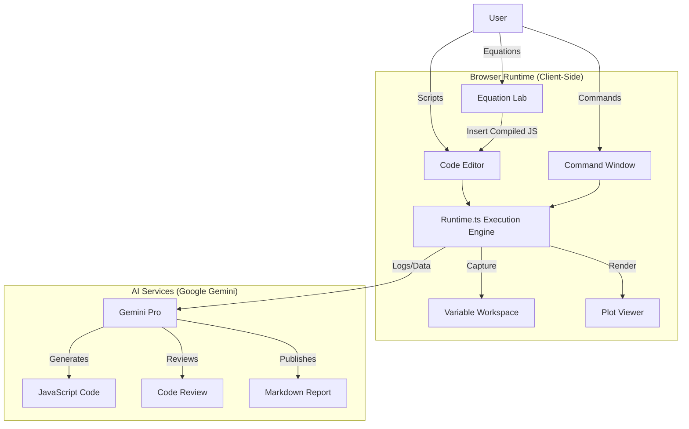

# Calcly IDE Architecture

## 1. High-Level Overview

**Calcly IDE** operates as a browser-based Integrated Development Environment. Unlike the previous chat-centric model, the core experience now revolves around the **Code Editor** and **Runtime Execution**, with AI acting as a Copilot rather than the primary interface.

### System Diagram

---

## 2. Core Components

### 2.1 The Runtime Engine (`lib/runtime.ts`)
This is the heart of the IDE. It allows for "stateful" execution directly in the browser.
-   **Sandboxing**: Code runs inside an ephemeral `iframe` to prevent conflicting with the React app state.
-   **Variable Harvesting**:
    -   After execution, the Runtime scans the frame's window object.
    -   It detects user-defined variables (including those declared via `const`/`let` by rewriting them to `var` or properties).
    -   These variables are surfaced in the **Workspace Viewer**.
-   **Persistence**: The state is maintained as long as the session is active (or until page refresh).

### 2.2 Equation Lab (`components/EquationEditor.tsx`)
A bridge between symbolic math and executable code.
-   **Input**: MathLive visual editor (LaTeX).
-   **Engine**: CortexJS Compute Engine.
-   **Compilation Pipeline**:
    1.  Parse LaTeX -> Canonical Form.
    2.  `expr.compile()` -> Native JS Function (e.g., `(scope) => scope.x + 1`).
    3.  **Adapter Layer**: Strips function wrappers and engine-specific context prefixes (`_.x`).
    4.  **Output**: Clean, copy-pasteable JavaScript source code (`x + 1`).

### 2.3 The AI Copilot (`services/geminiService.ts`)
The AI is integrated as a tool, not a wrapper.
-   **Generation**: Converts natural language ("Plot a sine wave") into code, which the user *then* runs. This puts the user in control.
-   **Reporting**: Reads the *execution state* (logs, variable values) to generate scientific reports, effectively acting as an automated lab assistant.

---

## 3. Server & Deployment Architecture

### 3.1 Runtime Environment Injection
To support modern containerized workflows (Docker/Cloud Run), Calcly separates build-time configuration from runtime configuration.

-   **Problem**: Vite apps are static. Environment variables are usually "baked in" at build time.
-   **Solution**:
    -   `server.js` (Express) serves the app in production.
    -   On every request to `index.html`, it reads the server's environment variables (`GEMINI_API_KEY`).
    -   It injects a `<script>` block defining `window.GEMINI_API_KEY`.
-   **Client Access**: The app checks `window.GEMINI_API_KEY` first. This ensures that a single Docker image can be deployed to `dev`, `staging`, and `prod` with different keys without rebuilding.

### 3.2 Docker Strategy
-   **Base**: `node:20-slim`.
-   **Process**: Multi-stage build (install -> build -> serve).
-   **Security**: Runs as a non-root user (implicitly handled by cloud providers, adjustable in Dockerfile).
-   **Exposed Port**: 8080 (standard for Cloud Run).

---

## 4. Technology Stack
-   **Framework**: React 19, Vite, TypeScript.
-   **UI**: Tailwind CSS, Lucide Icons, `react-resizable-panels`.
-   **Editor**: `@monaco-editor/react`.
-   **Math**: `nerdamer` (Symbolic), `mathjs` (Numerical), `plotly.js` (Vis).
-   **AI**: Google GenAI SDK (`@google/genai`).
