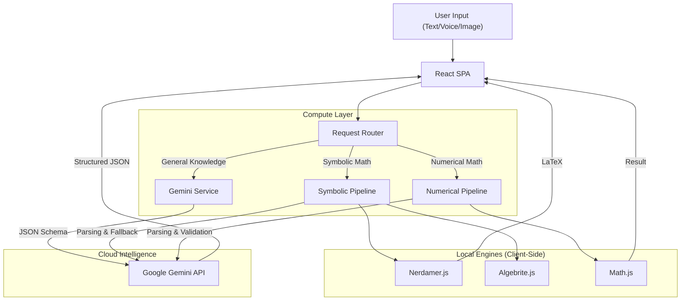

# Calcly Architecture Documentation

## Abstract

Calcly is an AI-powered computational knowledge engine designed to run on modern web browsers and mobile devices. Unlike traditional chatbots that rely solely on Large Language Models (LLMs) for math, Calcly utilizes a **Hybrid Computational Architecture**. It combines the reasoning capabilities of Google's Gemini models with the deterministic precision of local JavaScript symbolic math libraries (Nerdamer, Algebrite, Math.js).

This document outlines the system architecture, data flow, AI integration strategies, and component hierarchy.

---

## 1. High-Level Architecture

Calcly operates as a Single Page Application (SPA) served by a lightweight Node.js layer for runtime environment configuration.

### System Diagram

---

## 2. Core Technical Components

### 2.1 Frontend Client
- **Framework**: React 19 with Vite.
- **Language**: TypeScript.
- **Styling**: Tailwind CSS with dark mode support.
- **State Management**: React `useState` / `useRef` for local history and audio buffering.

### 2.2 Visualization & Rendering
- **Math Rendering**: `KaTeX` for high-performance LaTeX rendering.
- **Charts**: `Chart.js` via `react-chartjs-2` for rendering dynamic data sets generated by the AI.
- **Code**: `PrismJS` for syntax highlighting.
- **Markdown**: `Marked` with custom tokenization for mixing LaTeX/Markdown.

### 2.3 Server Layer (Runtime Injection)
- **Technology**: Express.js.
- **Purpose**: 
  1. Serves the static build assets.
  2. Implements **Runtime Environment Injection**. It reads `process.env.API_KEY` from the container environment (e.g., Google Cloud Run) and injects it into the `window.env` object in `index.html` at request time. This allows the same Docker image to be deployed across different environments without rebuilding.

---

## 3. The Hybrid Computational Pipeline

Calcly's core innovation is how it handles mathematical queries to avoid LLM hallucinations.

### 3.1 The Symbolic Solver (`SymbolicSolver.tsx`)
This component handles algebra, calculus, and symbolic manipulation.

1.  **Natural Language Parsing (Cloud)**: 
    *   The user's query (e.g., "Integrate x squared") is sent to **Gemini 3 Flash** with a high **Thinking Budget**.
    *   The AI translates this into a standardized JSON Command: `{ operation: "integrate", expression: "x^2", variable: "x" }`.
2.  **Execution Pipeline (Local)**:
    *   The system attempts to solve the standardized command using `Algebrite`.
    *   If `Algebrite` fails or returns an echo, it attempts `Nerdamer`.
3.  **AI Verification (Closed Loop)**:
    *   The local result is sent back to **Gemini 3 Flash** acting as a "Judge".
    *   The Judge validates if the local result makes sense mathematically.
4.  **Fallback**:
    *   If local engines fail or the Judge rejects the result, the system falls back to **Gemini 3 Flash** (Thinking enabled) to solve the problem natively.

### 3.2 The Numerical Solver (`NumericalSolver.tsx`)
This component handles arithmetic, statistics, and unit conversions.

1.  **Input Parsing**: User input is parsed by **Gemini 3 Flash** into valid `math.js` syntax (e.g., "Avg of 1 and 2" -> `mean(1, 2)`).
2.  **Custom Functions**: The engine injects custom implementations of `integrate` and `deriv` using numerical methods (Simpson's Rule, Central Difference) into the `math.js` scope.
3.  **Execution**: The parsed string is evaluated safely in the browser.

---

## 4. AI Model Strategy

Calcly uses specific Gemini models for specific tasks to balance cost, latency, and intelligence.

| Task | Model | Reason |
| :--- | :--- | :--- |
| **Parsing** | `gemini-3-flash-preview` | Enhanced with **Thinking Budget** for rapid, robust syntax translation. |
| **General Solver (Pro)** | `gemini-3-pro-preview` | Maximum intelligence for complex reasoning tasks. |
| **General Solver (Flash)** | `gemini-3-flash-preview` | Optimized for low-latency standard solving without sacrificing reasoning. |
| **Specialized Math AI** | `gemini-3-flash-preview` | Fast, dedicated solvers for symbolic fallback and step-by-step explanations. |
| **Validation (Judge)** | `gemini-3-flash-preview` | High-speed verification with reasoning to prevent hallucinated results. |
| **Voice/Audio** | `gemini-3-pro-preview` | Multimodal high-fidelity processing of audio and visual inputs. |

---

## 5. Deployment & Security

### 5.1 Environment Security
API keys are **never** hardcoded.
1.  **Local Dev**: Loaded from `.env` via Vite.
2.  **Production**: Injected by `server.js` into a global `window.env` object.

### 5.2 Error Handling
The `geminiService` includes a robust error handler that detects 429 errors, timeouts, and server overloads, providing graceful retries and fallback models.

---

## 6. Directory Structure
(See codebase for details).

---

## 7. Deep Linking & URL Integration

Calcly supports powerful URL-based interactions, allowing external apps or sites to trigger specific computational workflows.

### 7.1 Parameter Specification

| Parameter | Values | Description |
| :--- | :--- | :--- |
| `q` | String (URI Encoded) | The actual computational query or math problem. |
| `mode` | `pro`, `flash` | Sets the AI model intelligence level for the primary solver. |
| `tool` | `symbolic`, `numerical` | If present, opens the specialized modal tool instead of the main solver. |
| `auto` | `true`, `false` | If `true`, the query is automatically submitted on page load. |

### 7.2 Use Case Examples

#### General Knowledge / Structured Inquiry
`https://app.calcly.ai/?q=Compare+GDP+of+G7+countries&mode=pro&auto=true`
*   **Result**: Opens the main solver, performs a multi-country comparison, and renders a Bar/Line chart automatically.

#### Symbolic Math Deep-Link
`https://app.calcly.ai/?tool=symbolic&q=integrate+x^2+sin(x)&auto=true`
*   **Result**: Opens the **Symbolic Solver** modal, pre-fills the integral problem, and triggers the Algebrite/Nerdamer pipeline immediately.

#### Numerical Analysis Link
`https://app.calcly.ai/?tool=numerical&q=Standard+deviation+of+[10,20,30,40,50]&auto=true`
*   **Result**: Opens the **Numerical Solver** modal, pre-fills the data set, and calculates the result using the Math.js engine.

---
